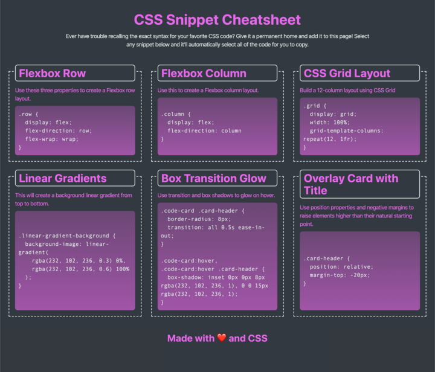
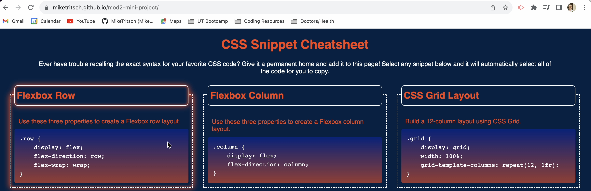
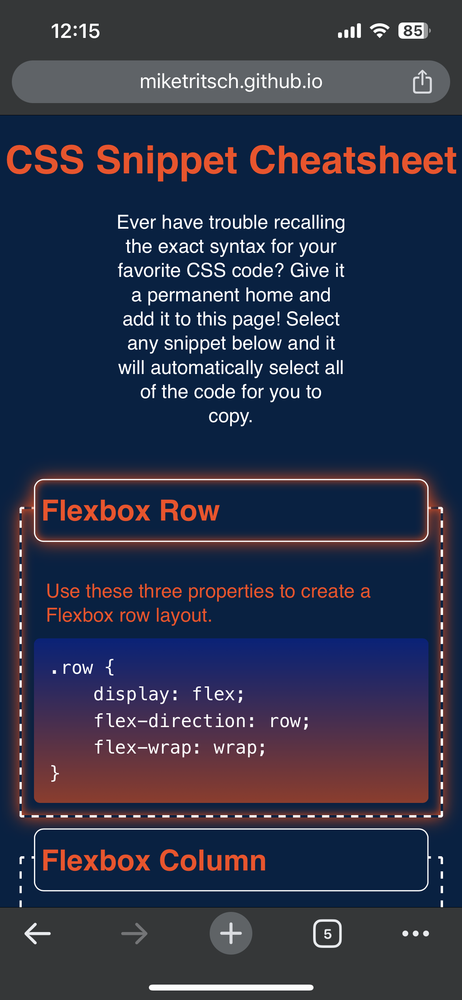
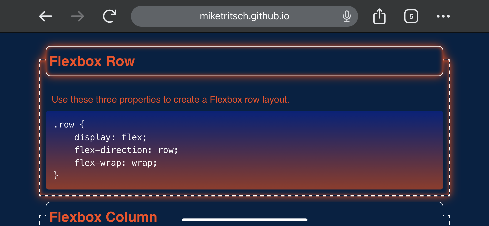

# module-2-mini-project

## Description

Welcome to the CSS Snippet Cheatsheet, created based on mini-project 2 at UT Austin's Full Stack Coding Bootcamp. This was the first project I was tasked with re-creating an image starting from scratch. 

Here is the original reference photo:

I was motiviated to build a project from scratch using only a reference photo in order to practice design, semantic HTML layout, appropriate div usage, and newly learned CSS tricks such as flexbox, media queries, and pseudo-selectors. This project also serves as a solution for quick and easy CSS references revlolving around flexbox. This was also the first time I wire-framed a project, which allowed me to see all of the barebones elements laid out on a page. One of my biggest personal challenges right now is keeping track of HTML layouts, and wireframing was a helpful process to curb this issue.

My wireframe via Google Slides

[Google Slides](https://docs.google.com/presentation/d/1vBLhs4m6VDSgB0sZ3bUabkF0c0orpINhgJYauOrMdv0/edit#slide=id.p)

I learned how to wireframe, use flexbox CSS selectors to make my page responsive, and how to layout an HTML page with multiple sections and divs. 

Once I completed the key concepts of this challenge, I swithced my color scheme to show pride for the Denver Broncos - my home state NFL team.

## Installation

No installation neccessary.
Thanks to media queries and flexbox, the page is available to view on mobile and desktop. Tablet view will be available soon.

## Usage

Hovering over the individual cards will cause a glow effect on all devices. (For mobile, tab the code cards.)

Desktop:

Mobile:

 

A single click on the code blocks (desktop only) will select and highlight all of the preformatted code for easy copy-paste.

Shrinking or expaning the size of the window will cause the content to move/flex.

## Credits

Broncos Color Sceme: [Team Color Codes](https://teamcolorcodes.com/denver-broncos-color-codes/)

Code Block Styling: [CSS Tricks](https://css-tricks.com/considerations-styling-pre-tag/)

## License

MIT License

Copyright (c) 2023 Mike Tritsch

Permission is hereby granted, free of charge, to any person obtaining a copy
of this software and associated documentation files (the "Software"), to deal
in the Software without restriction, including without limitation the rights
to use, copy, modify, merge, publish, distribute, sublicense, and/or sell
copies of the Software, and to permit persons to whom the Software is
furnished to do so, subject to the following conditions:

The above copyright notice and this permission notice shall be included in all
copies or substantial portions of the Software.

THE SOFTWARE IS PROVIDED "AS IS", WITHOUT WARRANTY OF ANY KIND, EXPRESS OR
IMPLIED, INCLUDING BUT NOT LIMITED TO THE WARRANTIES OF MERCHANTABILITY,
FITNESS FOR A PARTICULAR PURPOSE AND NONINFRINGEMENT. IN NO EVENT SHALL THE
AUTHORS OR COPYRIGHT HOLDERS BE LIABLE FOR ANY CLAIM, DAMAGES OR OTHER
LIABILITY, WHETHER IN AN ACTION OF CONTRACT, TORT OR OTHERWISE, ARISING FROM,
OUT OF OR IN CONNECTION WITH THE SOFTWARE OR THE USE OR OTHER DEALINGS IN THE
SOFTWARE.

---